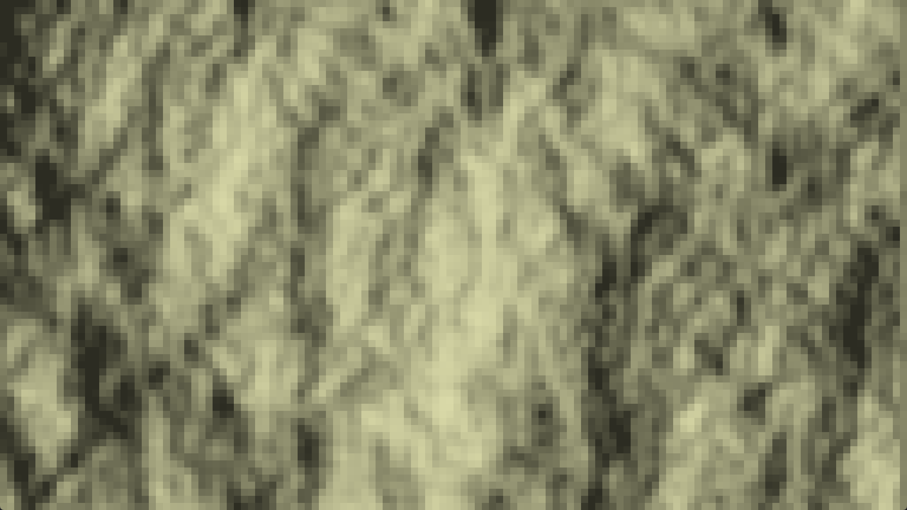
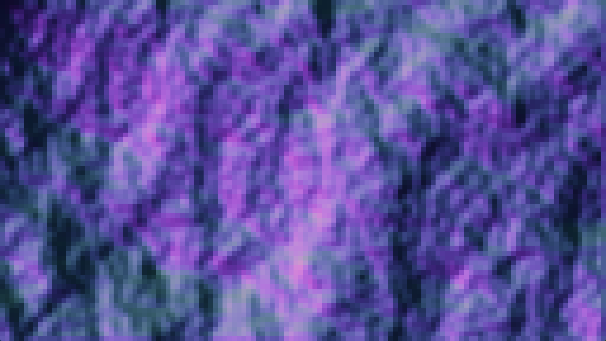

# Normal Mapping Practice

Welcome to Normal Mapping Practice, an experimental practice of normal mapping using python.

## About the Game

Normal Mapping Practice is a PRESENTATION PROJ for DKU INFOSCI-102.

## Preview
Here is the preview PNGs:

<div style="text-align:center">
  
  
</div>


## Usage

To use this code, follow these simple steps:

- To start the game, enter the command:
```bash
python main.py
```
- To control the light, press keyboard `←` and `→` buttons to apply left or right move of the light (default is left).
- Press keyboard `SPACE` button to pause the daylight timer, and press keyboard `ENTER` button to switch between the color map and normal map.
- By changing parameters in the `Config.py` file, you can adjust the how the noise generates the terrain, change the default color of the tiles, the height scale, and so on.

## Requirements

#### 1. Environment:
Make sure you have Python installed on your system to run the code successfully.

#### 2. Package:
Make sure the following dependent libraries are installed:
- `noise`
- `numpy`
- `pygame`

## Notes

This is a course PROJ. Feel free to contribute to the project by submitting bug reports or suggesting improvements. Feedback and ideas are welcomed to make Tetris Terminal Game better.

Happy gaming! 🎮
